# Gnome Town

## Description

This project is a responsive website layout which allows you to see the details of the inhabitants of Brastlewark. It is built using **React**, **styled components** and **TypeScript**. It also provides a clean and responsive design for easy customization based on **"mobile first"**.

This aplication features a list of inhabitants from "Brastlewark", sourced from an **API**, where the user can filter based on the inhabitants's name or their profession. The user can also sort the inhabitants by their age, either in ascending or descending order.

Additionally, if the user clicks on one of the inhabitants, they will access detailed information about them on a separate page.

## Table of Contents

- Installation and Quick Start Guide
- Usage
- Deployment
- Proyect structure
- Screenshots
- Lazy loading
- Used libraries
- License

## Installation and Quick Start Guide

To get started with this project, follow these steps:

1. Clone the repository to your local machine:

```bash

git clone https://github.com/carodriguezp/Gnome-town.git
```

2. Open the project folder in your preferred code editor.

3. Run a local development server (you can use tools like Live Server or any other server of your choice).

```bash
npm install
npm start
```

## Usage

After the installation, open the project in your browser and navigate through the sections to explore the content.

The website is designed to be responsive, providing a seamless experience across different devices such us mobile, tablet and desktop.

The size of the elements has been adapted using rem units instead of px, for example in font size and margin, which ensures better responsiveness and adaptability to various devices.

## Deployment

To deploy this proyect, please use the command bellow:

```bash
npm run deploy
```

## Proyect structure

Please find folder structure below:

```
src
 ├─ components
 |  ├─header
 |  ├─main
 |  |    ├─form
 |  |    |   ├─dropDown
 |  |    |   └─inputText
 |  |    ├─gnomes
 |  |    ├─CharacterDetail
 |  |    └─CharacterList
 |  |
 |  ├─ App
 |  ├─ common.types
 |  └─ LoadingState
 ├─ images
 ├─ services
 |  └─api.js
 └─ styles
```

## Screenshots

#### Mobile version

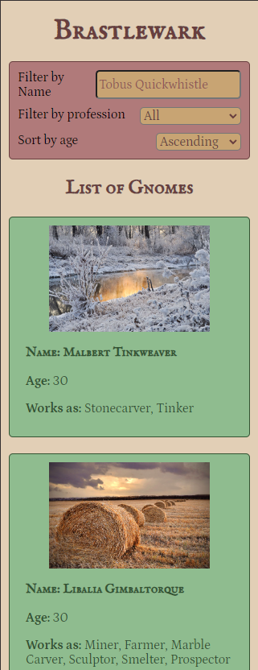
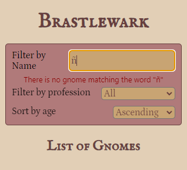
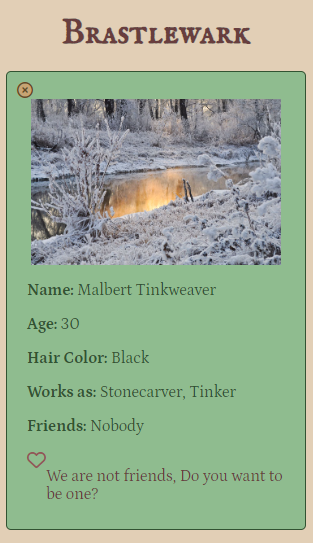
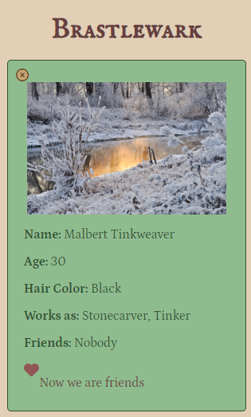

#### Tablet version and Desktop version

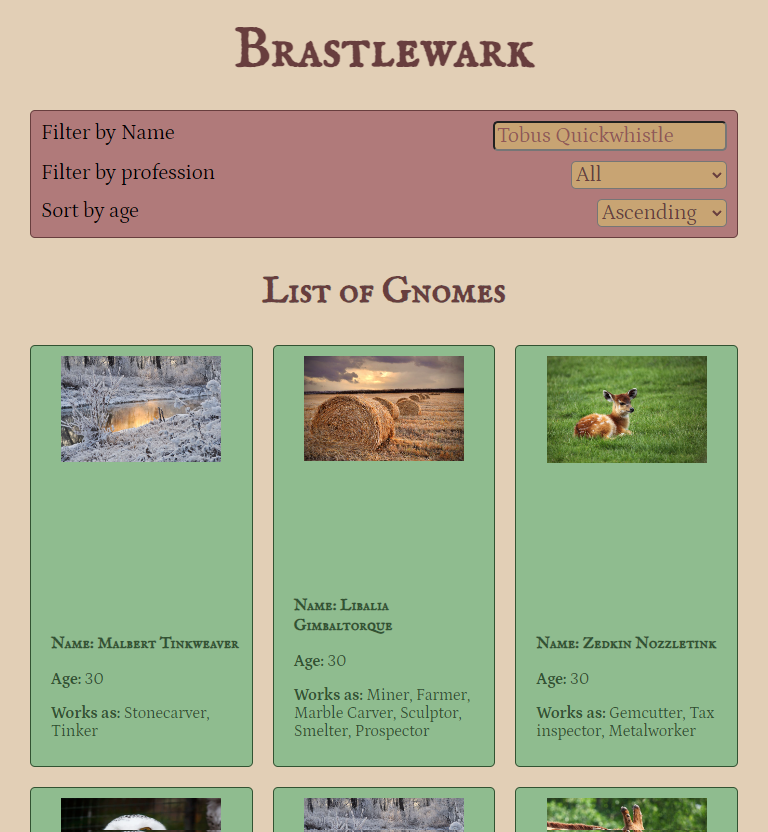
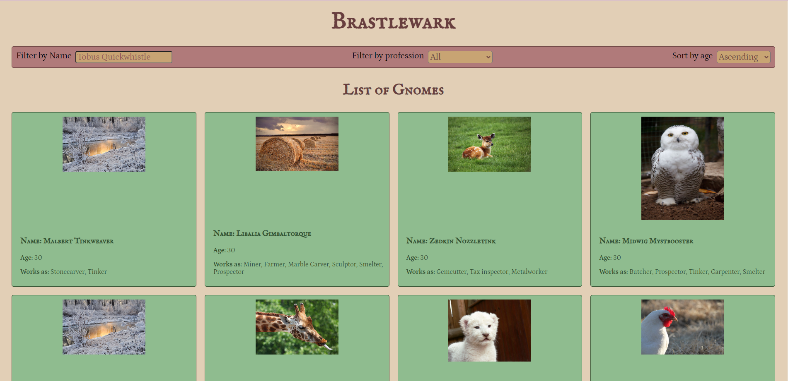
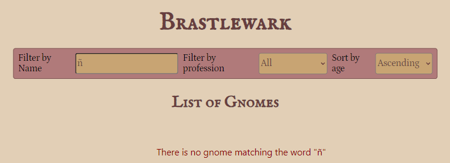
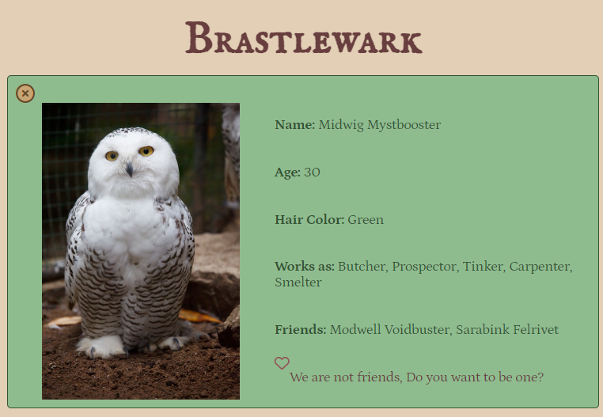
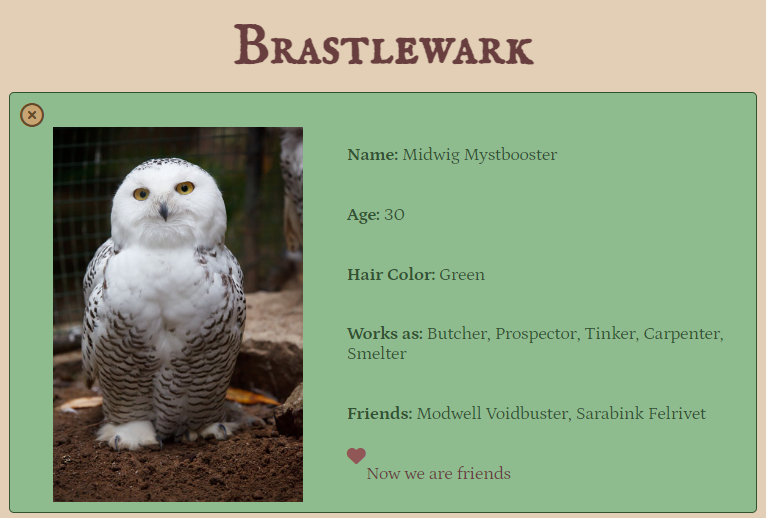

## Lazy loading

To enhance the application's performance, Lazy Loading has been utilized. This way, components are loaded only when the user needs them. This can reduce the initial loading time of the application and enhance the user experience by making the application feel more responsive.

To monitor the impact of implementing Lazy Loading in this project, the Lighthouse tool has been used. Additionally, performance, accessibility, SEO practices, and good web development practices have been analyzed. Below are the screenshots of the Lighthouse analysis before and after implementing Lazy Loading.

#### With Lazy loading

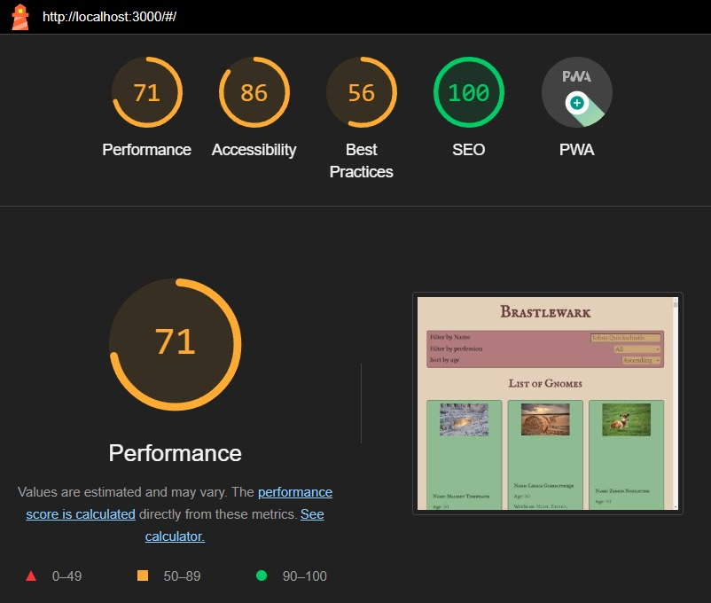

#### Without Lazy loading

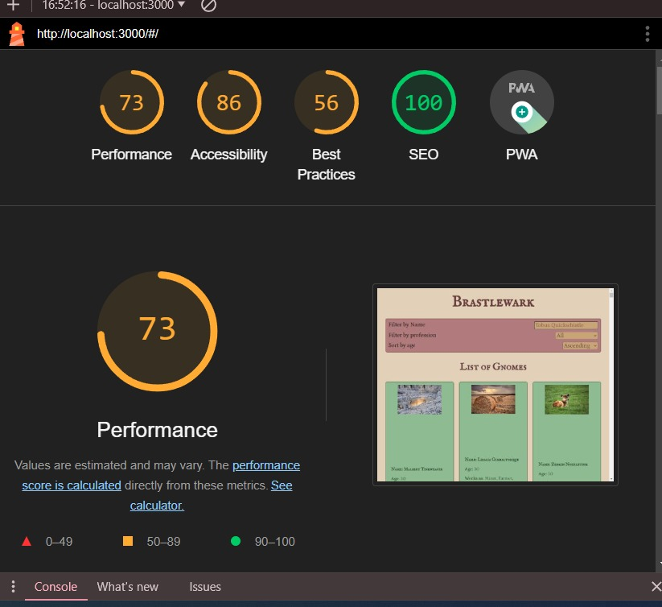

## Used libraries

- **React Testing Library:** The project uses React Testing Library to ensure that React components behave as expected through user-centered unit and integration testing.
- **TypeScript:** The project employs TypeScript to add static typing to React code, enhancing code quality, scalability, and early error detection.
- **Styled Components:** The project utilizes Styled Components to create styles in a modular and maintainable way by embedding them directly into React components.
- **React Router:** The project relies on React Router to handle navigation efficiently, making it easy to create routes and providing a smooth user experience.

> **NOTE:** The project has also utilized GitHub Pages for hosting the React application, providing a simple and free way to publish and share web content directly from a GitHub repository.

## Licence

This project is licensed under the **MIT License**. Feel free to use, modify, and distribute the code for your projects. Make sure to check the license for more details.
